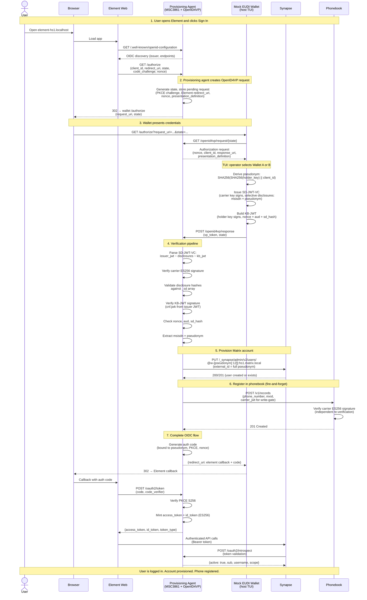

# Auth Flow — How a User Gets From "Sign In" to Chatting

Four actors: the **browser** (running Element Web), the **provisioning agent** (the homeserver's auth service), the **wallet** (holds the user's credentials), and **Synapse** (the Matrix homeserver). The **phonebook** appears at the end.

## The redirect chain

The user opens Element and clicks Sign In. Element doesn't know about wallets — it just knows it has an OIDC provider (the provisioning agent) and starts a standard OIDC authorization code flow with PKCE.

The provisioning agent receives the authorization request, but instead of showing a login form, it redirects the browser to the wallet. The redirect carries a `request_uri` — a URL the wallet can call back to fetch the details of what's being requested.

The wallet (running on the host with a terminal UI) receives the browser redirect. It calls back to the provisioning agent to fetch the authorization request, which says: "I need a carrier-attested phone number and a wallet-derived pseudonym." The operator selects which identity to present (Wallet A or B) in the terminal.

The wallet then builds a credential presentation: the carrier's signed attestation of the phone number, with the phone number and pseudonym selectively disclosed, plus a proof that the wallet holds the private key. It POSTs this back to the provisioning agent.

## Verification and provisioning

The provisioning agent verifies the presentation:

1. The carrier's signature on the credential is valid (the phone number attestation is authentic)
2. The disclosed claims (phone number, pseudonym) match the hashes in the signed credential (nothing was tampered with)
3. The wallet's proof binds to this specific request (not a replay)

Once verified, two things happen:

- **Synapse account** — the provisioning agent creates (or updates) a Matrix account on Synapse, using the pseudonym as the account identifier. The phone number never reaches Synapse.
- **Phonebook entry** — the provisioning agent registers the phone number → Matrix ID mapping in the phonebook, forwarding the carrier's signed attestation so the phonebook can independently verify it. This is fire-and-forget; if it fails, the login still succeeds.

## Completing the OIDC flow

The provisioning agent generates an authorization code and tells the wallet where to send the browser (back to Element's callback URL, with the code). The wallet redirects the browser there.

Element exchanges the code for tokens (access token + signed ID token) with the provisioning agent, using PKCE to prove it's the same client that started the flow. Element is now logged in.

From this point, Element talks to Synapse normally. Synapse validates each request by calling back to the provisioning agent's introspection endpoint — standard OIDC token validation.

## Discovery

A second user, provisioned on a different homeserver, opens Element and types the first user's phone number in the invite dialog. Element queries the phonebook (via the Identity Service v2 API), gets back the Matrix ID, and starts a conversation. The message crosses homeservers via federation.

## Sequence diagram

## What to read next

- [`src/provisioning-agent/README.md`](../src/provisioning-agent/README.md) — MSC3861 endpoints, OpenID4VP endpoints, verification pipeline
- [`src/mock-wallet/README.md`](../src/mock-wallet/README.md) — credential format, pseudonym derivation, what's mocked
- [`src/phonebook/README.md`](../src/phonebook/README.md) — write-gate mechanism, IS v2 compatibility
